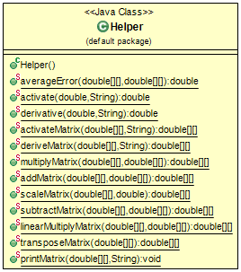
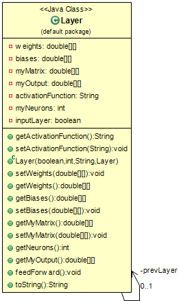
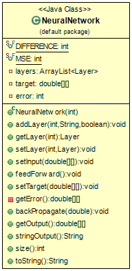

# Java-ANN-From-Scratch
I wanted to learn the theory behind Neural Networks instead of simply relying on libraries. I create my own implementation of a variable neural network in java

---

# Coding an Artifical Neural Network in Java from scratch

I've used tensorflow and keras previously and created several types of neural networks in python. However, I got curious to know what goes on behind the scenes and decided to understand the sometimes complicated math underneath the hood. After reading up on backpropagation and some matrix math, I started working on a neural network from scratch.

### Helper Class
First I create a Helper class. This will help in all matrix manipulations and specific math functions.

For matrix manipulations, I coded functions to multiply, add, scale, transpose, hamard product, subtract, and print matrices.

Example:

    public static double[][] multiplyMatrix(double[][] matrix1, double[][] matrix2) {
		double[][] result = new double[matrix1.length][matrix2[0].length];
		for (int i = 0; i < matrix1.length; i++)
			for (int j = 0; j < matrix2[0].length; j++) {
				result[i][j] = 0;
				for (int k = 0; k < matrix1[0].length; k++)
					result[i][j] += matrix1[i][k] * matrix2[k][j];
			}
		return result;
	}

### Layer Class

Next, I create a Layer object that contains a layer of neurons. Each layer has its own weights, biases, input matrix, activation function, and output matrix. Each layer also has a reference to the layer before it.

The layer has specialized functions as well such as feedForward():

    public void feedForward() {
		if (inputLayer)
			myOutput = myMatrix;
		else {
			myMatrix = Helper.multiplyMatrix(weights, prevLayer.getMyOutput());
			myMatrix = Helper.addMatrix(myMatrix, biases);
			myOutput = Helper.activateMatrix(myMatrix, this.activationFunction);
		}
	}
	
The reason behind making the matrices before and after activation separate is to test out several activation functions at the same time. This way, many activation functions can be tested at once allowing for multiple output matrices to make use of the same pre-activation matrix.

### NeuralNetwork Class

Finally, a NeuralNetwork class is created. It acts as a container for layers, handles input and output, connecting, adding, and general handling of layers.

It also handles feeding forward and back propagarion. Example:

	public void backPropagate(double learningRate) {
		double[][] temp = getError();
		double[][] transfer_derivative = Helper.deriveMatrix(layers.get(layers.size()-1).getMyOutput(),layers.get(layers.size()-1).getActivationFunction() );
		double[][] sensitivity = Helper.linearMultiplyMatrix(temp, transfer_derivative);
		sensitivity = Helper.scaleMatrix(sensitivity, -2);
		double[][][] sensitivities = new double[layers.size()][][];
		sensitivities[layers.size()-1] = sensitivity;
		for(int i=layers.size()-2;i>0;i--) {
			transfer_derivative = Helper.deriveMatrix(layers.get(i).getMyOutput(),layers.get(i).getActivationFunction() );
			temp = Helper.transposeMatrix(layers.get(i+1).getWeights());
			sensitivity = Helper.linearMultiplyMatrix(transfer_derivative, temp);
			sensitivities[i] = Helper.multiplyMatrix(sensitivity, sensitivities[i+1]);
		}
		for(int i=1;i<layers.size();i++) {
			temp = Helper.transposeMatrix(layers.get(i-1).getMyOutput());
			temp = Helper.multiplyMatrix(sensitivities[i], temp);
			temp = Helper.scaleMatrix(temp, learningRate);
			temp = Helper.subtractMatrix(layers.get(i).getWeights(), temp);
			layers.get(i).setWeights(temp);
		}
		for(int i=1;i<layers.size();i++) {
			temp = Helper.scaleMatrix(sensitivities[i], learningRate);
			temp = Helper.subtractMatrix(layers.get(i).getBiases(), temp);
			layers.get(i).setBiases(temp);
		}
	}

The neural network can also have different error computing methods such as MSE. Finally, to set up a neural network with 1 input neuron, 2 neurons in the middle layer, and 1 output neuron, here's a sample code:

    NeuralNetwork ann = new NeuralNetwork(NeuralNetwork.DIFFERENCE);
	ann.addLayer(1, "", false);
	ann.addLayer(2, "sigmoid", true);
	ann.addLayer(1, "linear", true);
